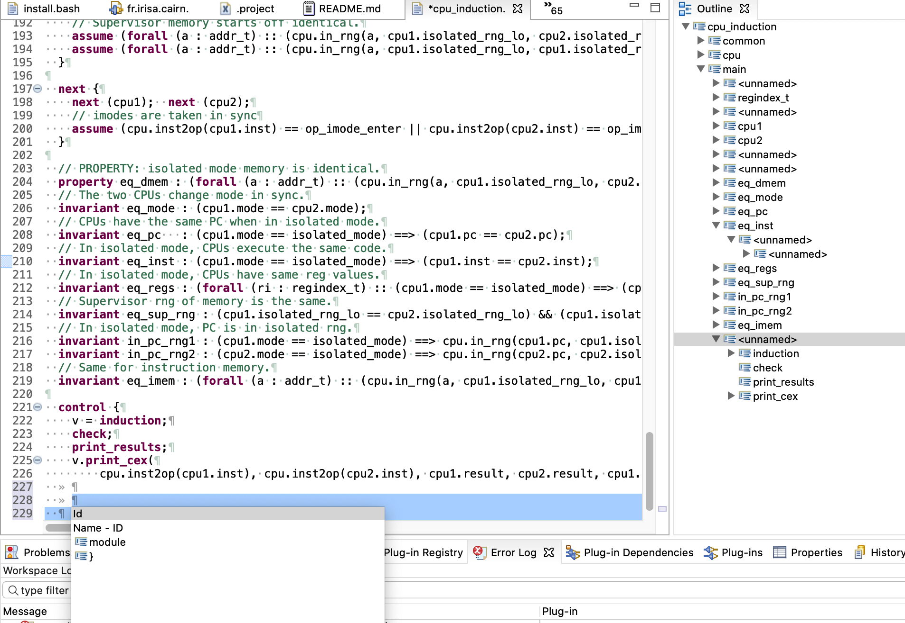

# Uclid-editor

Xtext base Eclipse IDE for Uclid5 modeling langage (https://github.com/uclid-org/uclid). 



# Full installation from command line (Linux only) 
```shell=
wget http://www.mirrorservice.org/sites/download.eclipse.org/eclipseMirror/technology/epp/downloads/release/2020-12/R/eclipse-dsl-2020-12-R-linux-gtk-x86_64.tar.gz
tar -xvzf eclipse-dsl-2020-12-R-linux-gtk-x86_64.tar.gz

./eclipse/eclipse -nosplash -application org.eclipse.equinox.p2.director \
	-repository \
	http://download.eclipse.org/releases/2020-12/,\
	https://raw.githubusercontent.com/sderrien/Uclid-editor/main/releng/uclid.xtext.updatesite/ \
	-destination ./eclipse/ \
	-installIU uclid.xtext.feature.feature.group 
```
# Eclipse update site 

https://raw.githubusercontent.com/sderrien/Uclid-editor/main/releng/uclid.xtext.updatesite/
